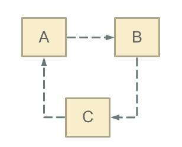

## Beans

#### 1. What is spring circular dependency and how is spring solved

- Three of them are the key factors that Spring solves for singleton beans. I call themLevel 3 cache：
  - The first level is singletonObjects
  - The second level is earlySingletonObjects
  - The third level is singletonFactories
  
- The process of solving the circular dependency on Spring
  0. problem
  
     
     
  1. First, A completes the first step of initialization and exposes himself in advance (exposing himself in advance through ObjectFactory). During initialization, he finds that he depends on object B. At this time, he will try to get(B). At this time, it is found that B has not yet Was created
  2. Then B went through the creation process. When B initialized, he also found himself dependent on C, and C was not created.
  3. At this time, C started the initialization process again, but during the initialization process, it found itself dependent on A, so it tried get(A). At this time, because A has been added to the cache (usually added to the third-level cache)singletonFactories)), exposed in advance through ObjectFactory, so you can passObjectFactory#getObject()The method to get the A object, C gets the A object successfully after completing the initialization, and then adds itself to the first-level cache
  4. Back to B, B can also get the C object to complete the initialization, A can successfully get B to complete the initialization. At this point, the entire link has completed the initialization process
  
- Workarounds
  1. Use @Lazy
        ```java
        @Component
        public class CircularDependencyA {
         
            private CircularDependencyB circB;
         
            @Autowired
            public CircularDependencyA(@Lazy CircularDependencyB circB) {
                this.circB = circB;
            }
        }
        ```
  
  2. Use Setter/Field Injection
        ```java
        @Component
        public class CircularDependencyA {
         
            private CircularDependencyB circB;
         
            @Autowired
            public void setCircB(CircularDependencyB circB) {
                this.circB = circB;
            }
         
            public CircularDependencyB getCircB() {
                return circB;
            }
        }
        ```
        ```java
        @Component
        public class CircularDependencyB {
         
            private CircularDependencyA circA;
         
            private String message = "Hi!";
         
            @Autowired
            public void setCircA(CircularDependencyA circA) {
                this.circA = circA;
            }
         
            public String getMessage() {
                return message;
            }
        }
        ```
  
  3. Use @PostConstruct
        ```java
        @Component
        public class CircularDependencyA {
         
            @Autowired
            private CircularDependencyB circB;
         
            @PostConstruct
            public void init() {
                circB.setCircA(this);
            }
         
            public CircularDependencyB getCircB() {
                return circB;
            }
        }
        ```
        ```java
        @Component
        public class CircularDependencyB {
         
            private CircularDependencyA circA;
            
            private String message = "Hi!";
         
            public void setCircA(CircularDependencyA circA) {
                this.circA = circA;
            }
            
            public String getMessage() {
                return message;
            }
        }
        ```
  
  4. Implement ApplicationContextAware and InitializingBean
        ```java
        @Component
        public class CircularDependencyA implements ApplicationContextAware, InitializingBean {
         
            private CircularDependencyB circB;
         
            private ApplicationContext context;
         
            public CircularDependencyB getCircB() {
                return circB;
            }
         
            @Override
            public void afterPropertiesSet() throws Exception {
                circB = context.getBean(CircularDependencyB.class);
            }
         
            @Override
            public void setApplicationContext(final ApplicationContext ctx) throws BeansException {
                context = ctx;
            }
        }
        ```
        ```java
        @Component
        public class CircularDependencyB {
         
            private CircularDependencyA circA;
         
            private String message = "Hi!";
         
            @Autowired
            public void setCircA(CircularDependencyA circA) {
                this.circA = circA;
            }
         
            public String getMessage() {
                return message;
            }
        }
        ```
  ref: https://www.baeldung.com/circular-dependencies-in-spring
  
  
  
  
  
  
  
  
  
  
  
  
  
  
  
  
  
  
  